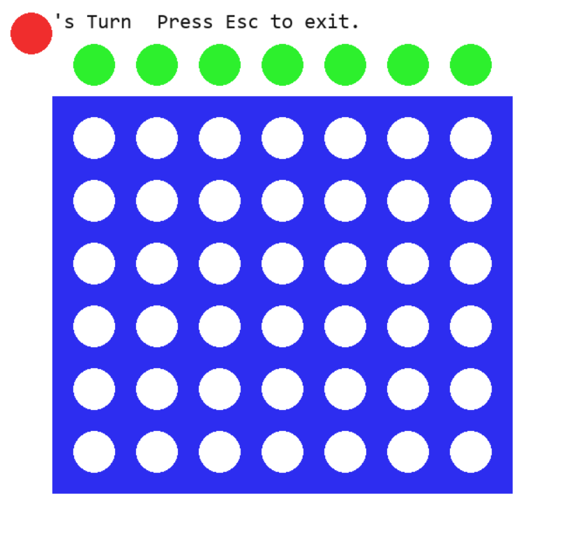

# Pygame-Connect-Four
Recreating classic connect four game using Pygame

Download the executable here:
https://drive.google.com/file/d/1Vv8t99qbcc_ScOF3oi-UBBHgYjpjkWFh/view?usp=sharing
________
Game features:
- two player mode
- versus Computer with 4 different difficulties
- resizable window
- resizable game grid up to 14x12 (default is 7x6)

You may get a warning that the executable may harm your computer. I have tested it on my own computers and with friends'. The executable is safe. This is normal with executables made with PyInstaller. I need to update this and freeze using PyInstaller 64-bit for Windows.
